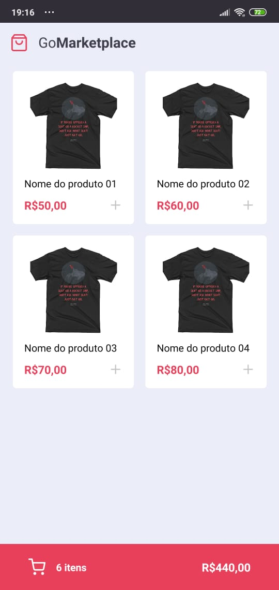
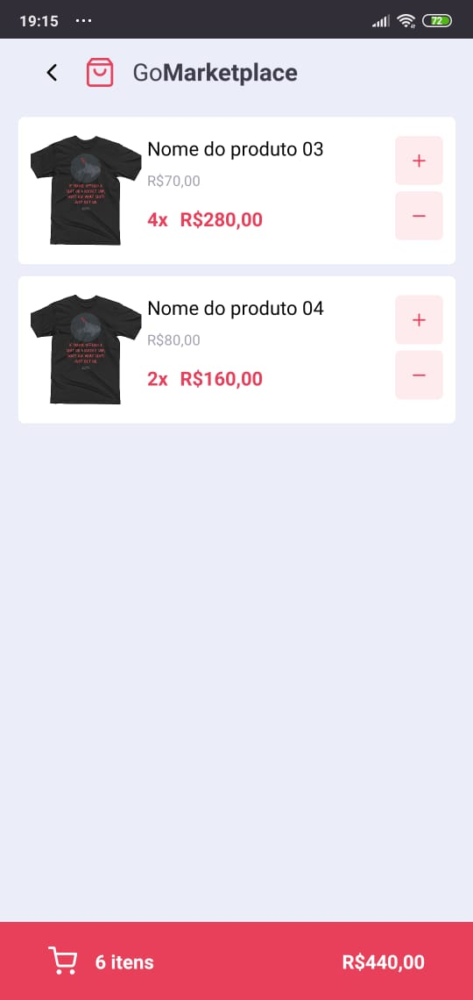

# GoMarketplace
O GoMarketplace é um aplicativo desenvolvido durante o bootcamp GoStack da @rocketseat, onde junto com TypeScript, utilizando rotas, Async Storage e a Context API, é feita uma simulação de um e-commerce de roupas.

